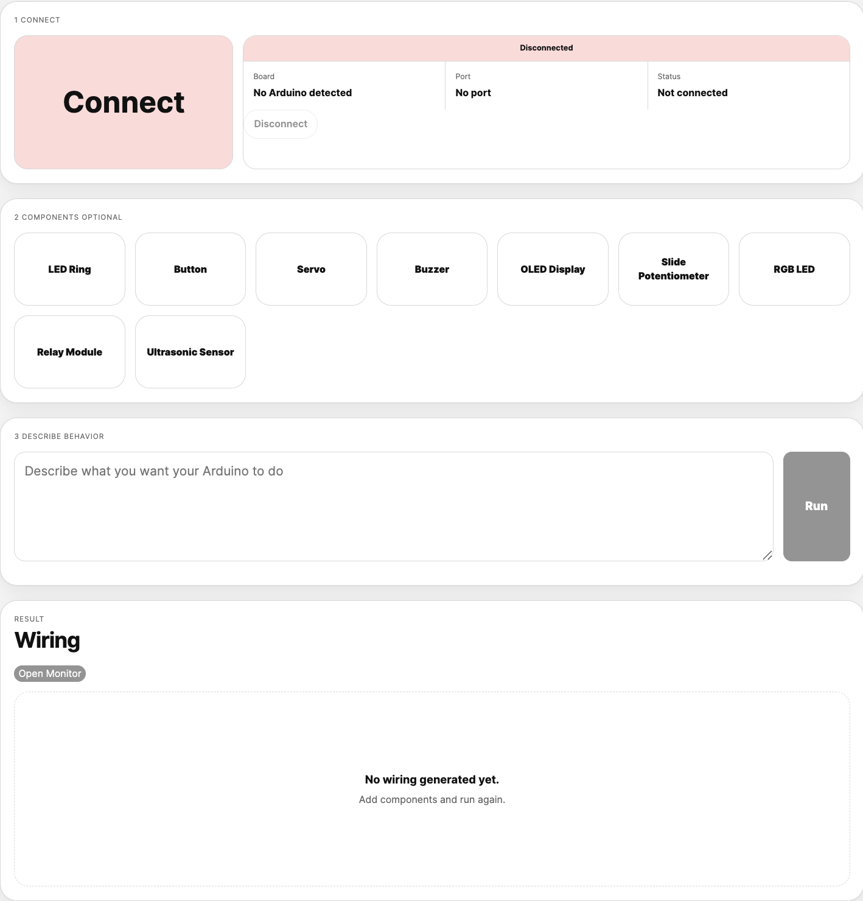
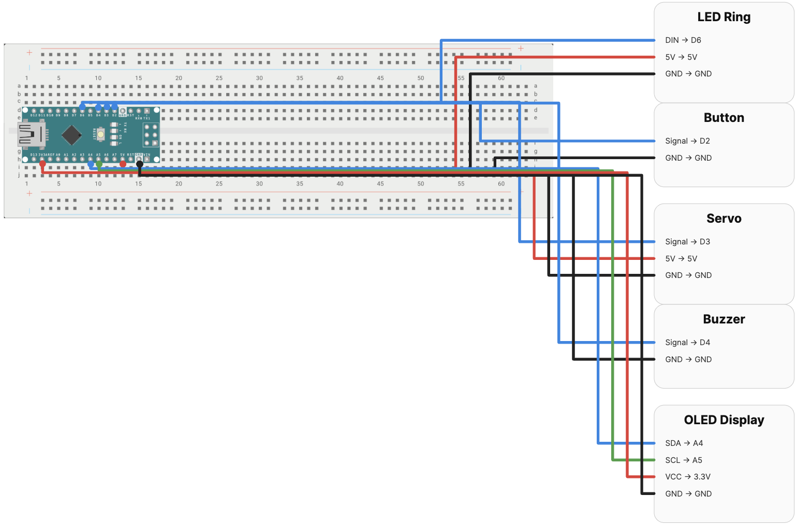

# Prompt-to-Programming for Physical Computing




A full-stack web application for generating Arduino programs and hardware wiring diagrams from natural language prompts.

The system converts text-based interaction into:
- Arduino code
- hardware wiring instructions
- SVG breadboard visualizations
- pin connection mappings
- live serial monitor streams
- automatic compile and upload workflows

The application combines prompt-based programming, visual hardware generation, and real-time Arduino interaction inside a unified interface for physical computing workflows.

---

## Workflow

```text
Connect Board
        ↓
Select Components
        ↓
Describe Behavior
        ↓
Generate Code + Wiring
        ↓
Compile + Upload
        ↓
Monitor Live Output
```

---

## Features

### Hardware Interaction
- Automatic Arduino board detection
- USB serial communication
- Automatic compile and upload using `arduino-cli`
- Real-time serial monitor streaming
- Dynamic board reconnection handling

### Code Generation
- Prompt-based Arduino sketch generation
- OpenAI-powered code generation
- Rule-based fallback generation system
- Component-aware hardware behavior generation
- Automatic pin assignment and mapping

### Wiring Visualization
- Dynamic SVG wiring diagrams
- Breadboard-based hardware layouts
- Color-coded wire rendering
- Pin connection tables
- Multi-component wiring support
- Real-time generated hardware visualization

### Interface Design
- Prompt-driven interaction flow
- Simplified hardware workflow
- Component selection interface
- Integrated programming and wiring pipeline
- Real-time system feedback

---

## Supported Components

| Component | Function |
|---|---|
| LED Ring | RGB lighting output |
| Button | Digital input |
| Servo Motor | PWM motion control |
| Buzzer | Audio output |
| OLED Display | I2C visual output |
| Slide Potentiometer | Analog input |
| RGB LED | Multi-channel color output |
| Relay Module | External device switching |
| Ultrasonic Sensor | Distance sensing |

---

## System Architecture

### Frontend
- React
- Vite

### Backend
- Node.js
- Express

### Hardware Layer
- Arduino CLI
- Serial communication
- Dynamic SVG renderer

### Code Generation Layer
- OpenAI API
- Local rule-based generation engine

---

## Project Structure

```text
apps/
├── server/
│   ├── src/
│   │   ├── config/
│   │   ├── routes/
│   │   ├── services/
│   │   └── utils/
│
└── web/
    ├── src/
    │   ├── components/
    │   ├── lib/
    │   └── styles/

generated-sketches/
```

---

## Local Setup

Install dependencies:

```bash
npm install
```

Run backend:

```bash
npm run dev:server
```

Run frontend:

```bash
npm run dev:web
```

Open the application:

```text
http://localhost:5173
```

---

## Arduino CLI Setup

Install Arduino CLI:

```bash
https://arduino.github.io/arduino-cli/
```

Install AVR board support:

```bash
arduino-cli core install arduino:avr
```

Verify board detection:

```bash
arduino-cli board list
```

Connect an Arduino board over USB before starting the application.

---

## Environment Variables

Create a `.env` file in the root directory:

```env
OPENAI_API_KEY=your_api_key_here
OPENAI_MODEL=gpt-3.5-turbo
```

---

## Example Prompts

```text
Blink the built-in LED every second
```

```text
Change the LED ring color when the button is pressed
```

```text
Show the room temperature every 1 second
```

```text
Rotate the servo when an object is detected
```

```text
Measure distance using the ultrasonic sensor
```

---

## System Output

The application automatically generates:
- Arduino sketches
- SVG wiring diagrams
- Breadboard layouts
- Pin connection mappings
- Serial monitor streams
- Upload and compilation workflows

---

## Core Services

| Service | Responsibility |
|---|---|
| `arduinoService.js` | Board detection, compile, upload |
| `codeGenerator.js` | Prompt-to-code generation |
| `wiringService.js` | Wiring diagram generation |
| `pinMapper.js` | Automatic pin assignment |
| `serialMonitorService.js` | Live serial communication |
| `api.js` | REST API routing |

---

## API Endpoints

| Endpoint | Description |
|---|---|
| `POST /api/connect` | Detect and connect Arduino board |
| `POST /api/run` | Generate, compile, upload, and visualize |
| `POST /api/generate` | Generate code and wiring only |
| `GET /api/serial-stream` | Live serial monitor stream |
| `GET /api/state` | Application state |

---

## Research Context

This project was developed as part of a master's thesis exploring prompt-based interaction workflows for physical computing systems.

The system investigates how natural language interfaces can simplify the relationship between programming, hardware configuration, and embedded system interaction.
